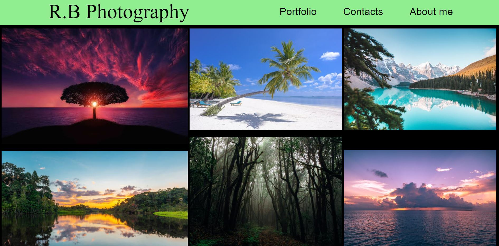

<h1 align="center" > R.B Photography </h1>
<h3 align="center">Responsive Photography Portfolio </h3>  

<!-- TABLE OF CONTENTS -->
<h2 id="table-of-contents">  Table of Contents</h2>

  
Table of Contents

  <ol>
    <li><a href="#about-the-project"> ➤ About The Project</a></li>
    <li><a href="#prerequisites"> ➤ Prerequisites/Tech used</a></li>
    <li><a href="#folder-structure"> ➤ Folder Structure</a></li>
   
  </ol>

<!-- ABOUT THE PROJECT -->
<h2 id="about-the-project">  About The Project</h2>

 
  This project aims to classify human activities using data obtained from accelerometer and gyroscope sensors from phone and watch. The raw data will be preprocessed using two
  different approaches such as topological data analysis and statistical features extraction from segmented time series. The goal is to compare and evaluate the performance of
  different classifiers (Decision Tree, k Nearest Neighbors, Random Forest, SVM and CNN) which are trained on the two sets of preprocessed data.

          
  <!--figcaption>Caption goes here</figcaption-->

<!-- PREREQUISITES -->
<h2 id="prerequisites">  Prerequisites/Tech used</h2>

<!--This project is written in Python programming language.  -->
The following Langauge/freamwork/technologies are used in this project:
* HTML
* CSS
* SCSS
* Bootstrap
* Git-version control
* Github repo
* GitHub Pages

<!-- FOLDER STRUCTURE -->
<h2 id="folder-structure"> Folder Structure</h2>

    HTML---CSS-Mini-Project
    │
    ├── css
    │   ├── about.css
    │   ├── contact.css
    │  
    ├── html
    │   ├── about.html
    │   ├── contact.html
    │ 
    |
    ├── images
    │   ├── media images
    │   
    |
    |
    ├── photos
    │   ├── photographs
    │  
    ├── index.html
    ├── styles.css
    ├── README.md 

